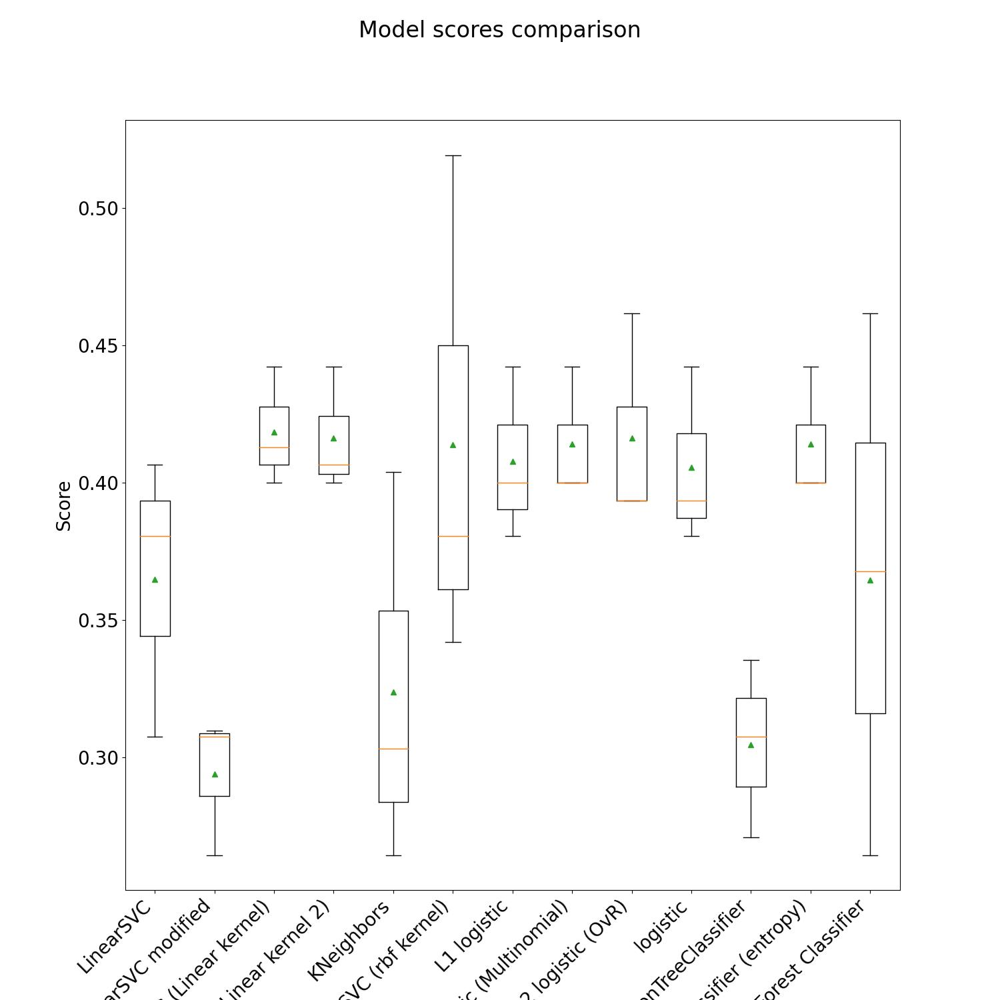
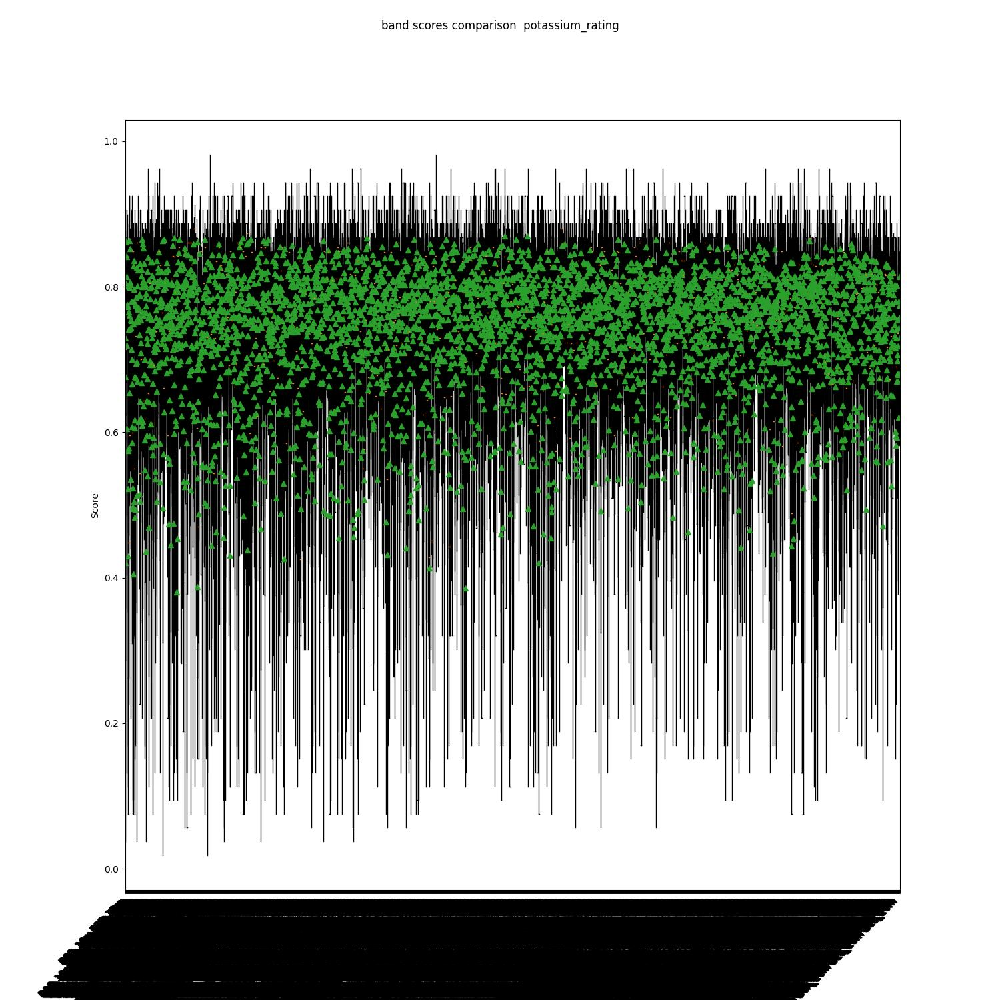

# Crop Yield

This script provides a means to download Sentinel 2 data for the specified farm regions, crop the images for each field and check
which are cloud covered. It loads the soil test data for each field and gets the nearest cloud free images to the date the soil
tests were conducted. The mean of each band of the selected Sentinel 2 product are calculated and added to the final [farms.csv](data/sentinel2/farm_summaries/farms.csv)
dataframe. This dataframe forms the basis of further analysis.

Once the above steps have been completed, the analysis functionality can be run to examine the data. Note that [farms.csv](data/sentinel2/farm_summaries/farms.csv) has already
been generated, using the farms from [MASTER_DOCUMENT_V1_240522.xlsx](data/farm_locations/MASTER_DOCUMENT_V1_240522.xlsx). If you wish to analyse new farms, you will have to run the download step above. If you are
happy to analyse the existing list, you can proceed without downloading any Sentinel 2 products and use the previously genertated [farms.csv](data/sentinel2/farm_summaries/farms.csv)

The script can also generate summary RGB images for each field over time. This depends on the user having already downloaded Sentinel 2 products (using the -d flag)
Note that the code ships with farm summaries for the existing list of farms.

Once the above data has been downloaded and processed, a number of analysis techniques can be employed in an effort to
examine the data in more detail and see if we can elicit any links between band means and soil test results.

## Getting Started

* Create a virtual environment:
    ```bash
    python3 -m venv ~/<path_on_your_machine>/<chosen_venv_name>/
    ```
* Activate the virtual environment:
  ```bash
  source ~/<path_on_your_machine>/<chosen_venv_name>/bin/activate
  ```
* Install python requirements
    ```bash
    pip install -r requirements.txt
  ```

## Running the script

To see the available options, run with the help flag:
```bash
python crop_yield.py --help
```
Resulting in:

```
Usage: crop_yield.py [OPTIONS]

  Download and process Sentinel 2 rasters.

  If you wish to download (-d), please ensure you set "SENTINEL_USER" and
  "SENTINEL_PASSWORD" environment variables. An account can be created at
  https://scihub.copernicus.eu/dhus/#/self-registration

  :param farm_summaries: :param crop_individual_farms: :param download: :param
  sentinel_date_range:

Options:
  -d, --download                  Download Sentinel 2 data. Note the
                                  downloader can be unreliable and you may
                                  have to kill and restart the script
                                  repeatedly
  -ci, --crop-individual-farms    Crop Sentinel 2 rasters, filter clouds and
                                  calculate band means
  -fs, --farm_summaries           Generate summary jpegs for specified bands
                                  over time
  -fa, --farm_analysis            Perform analysis on farms dataframe.  In
                                  progress
  --sentinel_date_range <TEXT TEXT>...
                                  Specify the date window to get sentinel
                                  data. Default is ("20210401", "20220401").
                                  Has to be combined with -d flag to start
                                  download  [required]
  --help                          Show this message and exit.
```

## Auto Initialisation

When the script starts, a number of initialisation steps happen, regardless of what options are supplied. See the 
`initialise()` function for full details. As shipped, the script will load in the list of farms in
[all_farms_24_05_22_cloud_free_products.geojson](data/farm_locations/all_farms_24_05_22_cloud_free_products.geojson).  If this file doesn't exist, it attempts to 
parse and load the farm information from [MASTER_DOCUMENT_V1_240522.xlsx](data/farm_locations/MASTER_DOCUMENT_V1_240522.xlsx) in the same directory.  This should be
clear from the `extract_geometries()` function.

## Download Sentinel 2 Data

**NOTE: If you wish to download Sentinel 2 data, you have to create an account and provide your
credentials as specified in the help text above**

It is almost certain you will have to run the download option repeatedly. You should keep an eye on the logs when running
it - I would advise setting the log level to DEBUG.  You will often see a message from the API advising the 
requested product is being retrieved from long term storage. This doesn't seem to take too long - if you try again
in an hour or so it is usually made available.  Once a product starts downloading, you should see a progress bar - it is 
not uncommon for progress to slow right down and hang. If this happens, stop execution and run again. Repeat this process
and you should be able to download the requested products eventually.

The list of products will be saved in [products.geojson](data/sentinel2/products.geojson). You should be able to view this in QGIS to see
the areas covered by the products. 

Sentinel 2 data will be downloaded and unzipped into the [sentinel2](data/sentinel2) directory.

**NOTE**

If you wish to download products from an area outside the bounding box of the existing fields, please examine the
`get_available_sentinel_products_df` implementation.  The granules of interest for the fields specified at time of
writing are hard coded in `required_granules = ("T43PFS", "T43PGS")`. We filter the available products to match these granule ids.
You may wish put a breakpoint in here before the filtering step to view the unfiltered list of products especially
if you want to download data for farms in different areas. Setting the `verify_products` parameter to true will
do some sanity checking plots in code. However, it may be easier saving the products dataframe to geojson and
viewing in QGIS if you are interested in other granules. Once you have determined the granules of interest, amend
`required_granules` and proceed with product download.

## Crop Individual Fields

If you have downloaded new Sentinel products, the next step you have to perform is to crop the product images to the 
bounds of individual fields by supplying the `-ci` option. A number of things happen at this point:
* For each farm, the code crops all product rasters to the specified bounding box. Once complete, in each product, navigate to 
* something like`data/sentinel2/S2B_MSIL2A_20211227T052229_N0301_R062_T43PFS_20211227T074640.SAFE/GRANULE/L2A_T43PFS_A025113_20211227T053237/IMG_DATA_CROPPED`
(substituting the correct product path) to see a list of the cropped rasters for each farm.
* Next, the code attempts to generate a list of cloud free Sentinel 2 product ids for each farm. It does this by inspecting the 
scene classification rasters supplied with each product and looking for various forms of clouds (search for  `Scene classification keys`).
If a cloudy pixel is found, we ignore the product. This seems to work reasonably well although isn't foolproof.
* Once we have a list of cloud free products for each farm, this is persisted in [all_farms_24_05_22_cloud_free_products.geojson](data/farm_locations/all_farms_24_05_22_cloud_free_products.geojson). If
you wish to regenerate this list, you have to delete this file.
* Finally, for each farm, we read the soil test date and get the Sentintel 2 product generated at the nearest time. We read the
farm rasters from this product and calculate the means for each band. This information in stored in [farms.csv](data/sentinel2/farm_summaries/farms.csv)

## Farm Summaries

This is an optional step which allows you to plot how each field changes over time. The code ships with summary plots 
already generated over the last year. See [farm_summaries](data/sentinel2/farm_summaries/). If you want to run this again, ensure you 
have downloaded Sentinel 2 data

## Analysis

The -fa flag calls the `perform_analysis` function. **You should examine the code in this function before running it.** It contains a 
number of experimental data analysis steps to see if we could find any links between band means and test results. It is likely
you will want to comment/uncomment various analysis as you see fit.  Beware that some of the analysis can run for an extended period.

If you only wish to run the analysis on the existing farm list, you don't have to download the Sentinel 2 data as the code
ships with the generated list of farms, band means and soil test results in [farms.csv](data/sentinel2/farm_summaries/farms.csv).

Analysis results are stored in [analysis](data/sentinel2/farm_summaries/analysis)

The analysis function can invoke any of the following (comment/uncomment in the script as you see fit)

### RGB Plots
RGB Plots of all fields used in [farms.csv](data/sentinel2/farm_summaries/farms.csv). This allows you to visually check the quality of data 
and is useful for checking if any fields are obscured by cloud, which can happen as the automatic cloud detection 
only works up to a point. The shipped farms dataframe originally included a number of fields that on visual inspection
were either wholly or partially cloud covered. See the note in `generate_band_means_at_soil_test_date` for how to deal with
this. Essentially that function has to be re-run with the occluded field ids added to `field_ids_with_clouds`. Generate 
the RGB field plots again by calling `_plot_rgb_for_fields_chosen_for_analysis` and inspect. If there are still cloudy
fields, add their ids only to `field_ids_with_clouds` (removing any previous ids) and repeat. **Be careful: see the notes in the code - if you
re-run repeatedly without removing the ids in `field_ids_with_clouds`, the code will select products further and
further away from the soil test date.** 

You might also want to use the generated field plots to filter the list of fields for analysis - some are very small
and I would question whether we get enough information at the resolutions Sentinel 2 supports.

Farm plots of nearest cloud free Sentenel products to the soil test dates:


### Correlation plots
The initial data exploratory step involved creating correlation plots for the band means and soil test results. Note that 
we created separate plots for Carbon, Potassium, Phosphorus and Nitrogen. This approach was taken as we didn't have
test results for each category for all fields. Each correlation plot was derived only from fields where we had test results.
Note that any test results of 0 in the farms dataframe indicate that we don't have a result for that field. 

* Carbon rating correlation
  
* Nitrogen rating correlation
 
* Potassium rating correlation
 
* Phosphorus rating correlation
 

As expected, there doesn't appear to be any obvious linear correlation for any of the soil tests.

### Testing a variety of classifiers

Looking at [machine_learning_map](https://scikit-learn.org/stable/tutorial/machine_learning_map/index.html) gives us
an idea of the classification ML models that may be of use. The `test_different_classifiers()` function
performs some exploratory tests with a number of classifiers. This code would benefit from further investigation - due
to time constraints the code only uses the four 10m bands and only looks for a link to the carbon soil test results.
The same bands are passed to a number of classifier models. The code generates various information for each,
including plots of confusion matrices and accuracy scores. We generate accuracy scores using three different methods.
See the sklearn docs for further info, but essentially I think the `scores_stratified_KFold` and `scores_cross_val` are
a more indicator of performance as they splice and dice the training data a number of times. We then store the mean value for each.
After all classifiers have been tested, a couple of plots are generated.

Below shows the spread of scores using the four 10m bands looking for a relation to the carbon soil test results
 

Given time, this should be extended to use more bands (varying combinations) and also to look for links to the other 
soil test results.

### Test LinearClassifier with combinations of 10 and 20m bands for each soil test field

The `_test_linear_svc_classifier_with_different_band_combinations_inputs` function starts with a list of the 10 and 20m 
bands. The idea of this analysis is to sequentially pass all combinations of each of these bands to the LinearSVC classifier and
compute scores in the same way as above. Using the 10 and 20 metre bands results in 4096 different band combinations. Beware, 
it takes some time to work through this. The 60m bands were discounted at this point is it would have resulted in over
16 million combinations. We do this for each of the soil test categories. The results are in the [analysis](data/sentinel2/farm_summaries/analysis)
directory as usual. The source data is stored in 
csv files in the [analysis](data/sentinel2/farm_summaries/analysis) directory.

The following results were obtained:

* The carbon soil test results band analysis results are stored in 
[carbon_10_20_bands.csv](data/sentinel2/farm_summaries/analysis/carbon_10_20_bands.csv). This was used to generate the summary plot of model accuracy
score ranges (where the green triangles represent the mean) for band combinations displayed below.  With mean scores in the 30-40% range,
it doesn't appear any of the band combinations with passed to the LinearSVC are able to reliably predict soil carbon content.

The 10 best performing band combinations for carbon prediction can be seen in the following bar and box plots:


  
* The phosphorous soil test results band analysis results are stored in
  [phosphorus_rating_10_20_bands.csv](data/sentinel2/farm_summaries/analysis/phosphorus_rating_10_20_bands.csv). A similar plot shows slightly improved
performance with mean scores in the 40-55% region. This probably warrants further investigation, possibly tuning LinearSVC further or trying
another classifier to see if the results can be bettered.
  
The 10 best performing band combinations for phosphorus prediction can be seen in the following bar and box plots:


* The nitrogen soil test results band analysis results are stored in
  [nitrogen_rating_10_20_bands.csv](data/sentinel2/farm_summaries/analysis/nitrogen_rating_10_20_bands.csv). This plot looks more promising with mean model scores
in the region of 75-85% accuracy. It may be that tuning the existing classifier or trying the same analysis on other classifiers will improve performance further. 
  
The 10 best performing band combinations for nitrogen prediction can be seen in the following bar and box plots:


* The potassium soil test results band analysis results are stored in
  [potassium_rating_10_20_bands.csv](data/sentinel2/farm_summaries/analysis/potassium_rating_10_20_bands.csv). The results show mean scores in the 75-85% region as
above.
  
The 10 best performing band combinations for potassium prediction can be seen in the following bar and box plots:


## Notes

You may wish to change the log level for the script - see `logging.basicConfig` near the start of the script. If you are
cropping field rasters, the logs get very busy with gdal output if set to debug. If the script is working as
expected, setting to info speeds things up substantially.

There are a number of functions in the script that are not explicitly called. Many were used to explore the Sentinel 2 
data. I have left them in in case they are of any use if e.g you want to look at calculating band means over a
series of Sentinel 2 products etc.